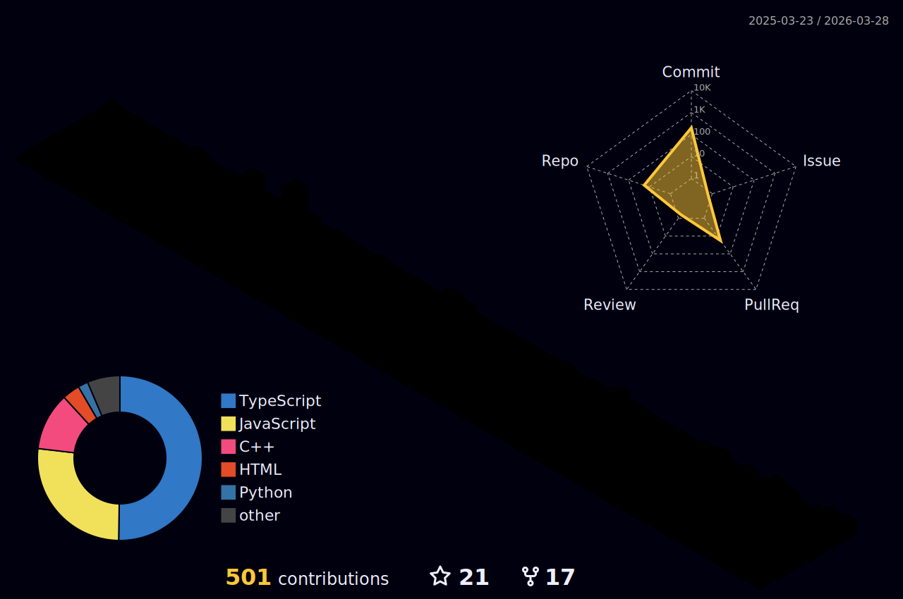

# Hi there, I'm Achyut Katiyar! 

  
  

## About Me

Hello! I'm **Achyut Katiyar**, a passionate **Full Stack Developer**, **Blockchain Enthusiast**, and **AI/ML Explorer**. Currently, I'm pursuing my Master's in Computer Science at [Northeastern University](https://www.northeastern.edu/) in Boston. I love building innovative solutions that tackle real-world problems and exploring emerging technologies across multiple domains.

🏆 **Hackathon Winner** with **$2,700+** in prizes across multiple competitions  
🚀 **Professional Developer** with experience building platforms for **3000+ users**  
🎯 **Technical Leader** who has mentored **15+ developers** and boosted engagement by **40%**

- 🔭 I'm currently working on developing full stack and blockchain projects  
- 🌱 I'm continuously learning new technologies in web development, blockchain, and artificial intelligence  
- 👯 I'm looking to collaborate with like-minded developers and researchers  
- 💬 Ask me about React, Next.js, Node.js, Blockchain, AI, Data Structures, Algorithms, and more  
- 😄 Pronouns: His/He

## 🏆 Hackathon Wins & Awards

| 🏅 **Competition** | 💰 **Prize** | 🎯 **Achievement** |
|:---|:---:|:---|
| **Hacker House Goa 2024** | **$1,500** | 🥇 **Nillion Track Winner** |
| **Move it with Aptos** | **$600** | 🥇 **1st Place Winner** |
| **HACKSRM 5.0** | **$500** | 🥇 **Marbelism Prize** |
| **APPATHON 2022** | **$100** | 🥇 **Winner** |

**Total Prize Money: $2,700+** 💸

## 💼 Professional Experience

### Full Stack Web Developer | SRM University - AP
**January 2024 – June 2024 | Vijayawada, India**
- 🚀 **Developed a full-stack web portal** using React.js, Node.js, and MongoDB for **3000+ UROP/Capstone students**
- ⚡ **Optimized UI/UX performance**, reducing page load time by **60%** and improving cross-device responsiveness
- 📊 **Achieved 75% grading accuracy improvement** and **50% evaluation efficiency boost** through workflow automation

### Technical Intern | SRM University - AP  
**October 2023 – June 2024 | Vijayawada, India**
- 🌐 **Orchestrated technical operations** for **30+ university events** with integrated payment gateways
- 📈 **Increased event participation by 25%** through strategic website design and deployment
- 🎯 **Boosted user satisfaction by 75%** and reduced coordination time by **60%** via automated dashboards
- ✅ **Achieved 95% client satisfaction** through seamless cross-functional collaboration

## 🚀 Tech Stack & Skills

### 💻 Programming Languages

### 🎨 Frontend Development

### ⚙️ Backend Development

### 🗄️ Databases & Cloud

### 🚀 DevOps & Deployment

### 🔗 Blockchain & Web3

### 🤖 AI/ML & Data Science

### 🛠️ Development Tools

## 🎯 Areas of Expertise

<table>
  <tr>
    <td align="center" width="200">
       
      <strong>Full Stack Development</strong> 
      <em>Building scalable web applications</em>
    </td>
    <td align="center" width="200">
       
      <strong>Blockchain Development</strong> 
      <em>Smart contracts & DApps</em>
    </td>
    <td align="center" width="200">
       
      <strong>AI/ML Engineering</strong> 
      <em>Machine learning models & data analysis</em>
    </td>
  </tr>
</table>

## 🚀 Featured Projects

### 🏆 Zenith - Decentralized Music Platform *(Winner - Hacker House Goa 2024)*
**Tech Stack:** React.js, Tailwind, Solidity, Polygon, IPFS, Smart Contracts, Web3  
- 🎵 **Built platform for 150+ artists** to mint and sell music NFTs with **300+ transactions**
- ⚡ **30% faster monetization** via Polygon blockchain integration
- 🎯 **65% increase in session duration** through community hubs and interactive features
- 🚀 **30% reduction in platform latency** by eliminating third-party dependencies

### 🏆 PokeArena - Blockchain Trading Platform *(Winner - Move it with Aptos)*
**Tech Stack:** React.js, Node.js, Tailwind, Three.js, Web3, Move, Blockchain  
- 🃏 **Digitized 300+ Pokémon cards as NFTs** with secure trading and battling
- 🔐 **Integrated Aptos wallet authentication** for **120+ seamless NFT trades**
- 🎨 **60% improvement in user engagement** through pixel art-inspired UI/UX
- ⚡ **Real-time transaction feedback** with on-chain verified ownership

### ⚡ Lightning Time - Bitcoin Rewards Tracker *(MIT Bitcoin Expo)*
**Tech Stack:** React, Node.js, Tailwind, LNbits, Lightning Network  
- 💰 **Real-time time tracking** with Bitcoin (SATs) payments via Lightning Network
- 🔄 **Instant micro-payments** integration using LNbits API
- 📊 **Built comprehensive stats dashboard** for hours and earnings tracking
- 🤖 **AI-powered productivity analytics** for usage and work pattern insights

## 🌟 Leadership & Impact

### 🎯 Technical Leadership
- **Convener** of University's Technical Team
  - 📈 **Boosted student engagement by 40%** through strategic committee formation
  - 🌐 **Led large-scale web initiatives** across university departments

### 👨‍🏫 Mentorship & Development  
- **Board Member** of APP Design and Development Club
  - 🚀 **Elevated 15+ junior developers** with tailored workshops and code reviews
  - 📊 **Achieved 60% improvement in coding skills** through hands-on training programs

## 3D Contribution Calendar

  

## GitHub Stats

  
  
  

## Connect with Me

  <!-- Website -->
  
  <!-- LinkedIn -->
  
  <!-- Email -->
  

