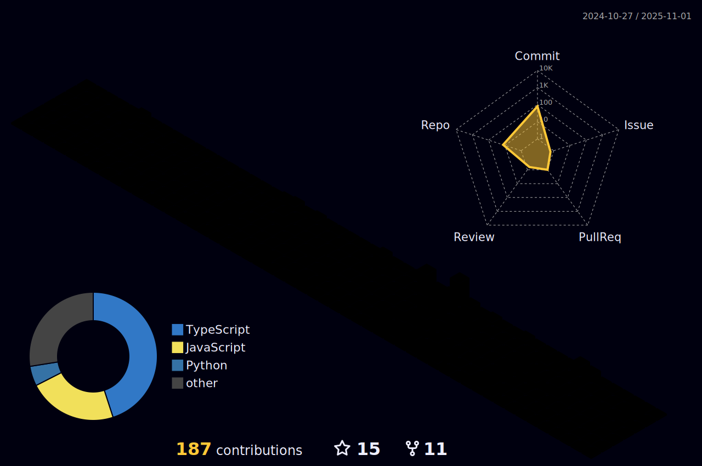

# Hi there, I'm Achyut Katiyar! 

  
  

## About Me

Hello! I'm **Achyut Katiyar**, a passionate **Full Stack Developer**, **Blockchain Enthusiast**, and **AI/ML Explorer**. Currently, I'm pursuing my Master's in Computer Science at [Northeastern University](https://www.northeastern.edu/) in Boston. I love building innovative solutions that tackle real-world problems and exploring emerging technologies across multiple domains.

- 🔭 I'm currently working on developing full stack projects.  
- 🌱 I'm continuously learning new technologies in web development, blockchain, and artificial intelligence.  
- 👯 I'm looking to collaborate with like-minded developers and researchers.  
- 💬 Ask me anything about React, Next.js, Node.js, Blockchain, AI, Data Structures, Algorithms, and more.  
- 😄 Pronouns: His/He

## 🚀 Tech Stack & Skills

### 💻 Programming Languages

### 🎨 Frontend Development

### ⚙️ Backend Development

### 🗄️ Databases & Cloud

### 🚀 DevOps & Deployment

### 🔗 Blockchain & Web3

### 🤖 AI/ML & Data Science

### 🛠️ Development Tools

## 🎯 Areas of Expertise

<table>
  <tr>
    <td align="center" width="200">
       
      <strong>Full Stack Development</strong> 
      <em>Building scalable web applications</em>
    </td>
    <td align="center" width="200">
       
      <strong>Blockchain Development</strong> 
      <em>Smart contracts & DApps</em>
    </td>
    <td align="center" width="200">
       
      <strong>AI/ML Engineering</strong> 
      <em>Machine learning models & data analysis</em>
    </td>
  </tr>
</table>

## 3D Contribution Calendar

  

## GitHub Stats

  
  
  

## Connect with Me

  
  
  

